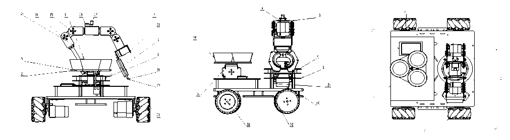
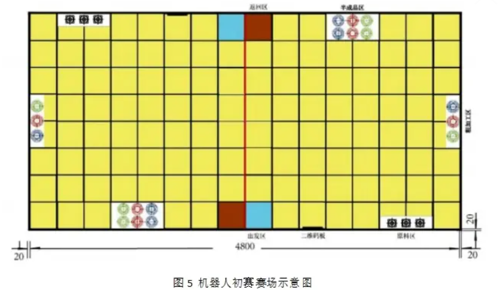

# LogisticsHandlingRobot

---

Packages of **LogisticsHandlingRobot** Repo

`STM32F103ZET6`  主控的Keil工程文件夹

`OPENMV4`  Openmv代码

`pic`  存放图片

`doc`  存放相关硬件、外设文档

`structure` 存放结构相关的文件

---

This repo is for **2022 ’s Guangdong College Students Engineering Practice and Innovation Ability Competition**.

We got the **frist prize in LogisticsHandlingRobot Competition** finally.  🏆

## 1. Authors 🤜🤛

🐱 [MenHimChan (WenQianChen) (github.com)](https://github.com/MenHimChan)

🐯 [YWpepper (wen.Yan) (github.com)](https://github.com/YWpepper)

🤴 [UltraDrone (UltraDrone) (github.com)](https://github.com/UltraDrone)

## 2. Environment 🕹

The project is based on the following environment:

+ STM32 F103 ZET6 (Standard Peripheral Library)
+ OPENMV4 H7
+ 42 StepMotor + FOC
+ Metal Servo + Hiwonder - Servo Control board 
+ ......

All of out hardware information can be found in `doc` directory.

## 3. Robot Appearance 🤖

## 4. Our Competition map 🗺

## 5. PCB projects 🔨

Here is part of our PCB projects, plz feel free to clone:

## 6. See our VedioClip 👇

[2023广东省工训工创赛比赛实录_哔哩哔哩_bilibili](https://www.bilibili.com/video/BV1Qs4y1S7nz/)

## 7. Last 🙏

❓  Problems are welcomed to be raised in `Issues` .

🙏  If u find our code useful, we will appreciate it if u can `give our project a star🌟🌟🌟`, thanks a lot !

